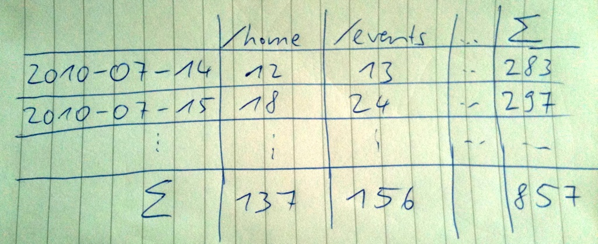

!SLIDE
# Different use case: Counts #

!SLIDE center

!SLIDE
# A count for each inner cell #
    counts:2010-07-14 = 
      [(12, '/home'), (13, '/events')]

    counts:2010-07-15 =
      [(18, '/home'), (24, '/events')]

!SLIDE
# A count for each row sum #
    counts:2010-07-14:sum = 283
    counts:2010-07-15:sum = 297

!SLIDE
# A count for each column sum #
    counts:home   = 137
    counts:events = 156

!SLIDE
# A count for the whole sum #
    counts:sum = 857

!SLIDE bullets
# Conclusion #
* Redis optimizes for specific use cases
* Huge benefits if your case fits
* Think about your reads before organizing your writes
* And vice versa!
