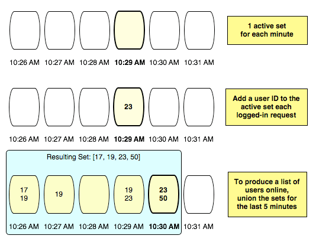
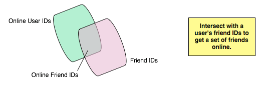

!SLIDE bullets
# practical examples #

!SLIDE bullets
# Who's online #

!SLIDE center

!SLIDE center

!SLIDE
# Worldcup prediction game #

!SLIDE bullets
# How it works #
* Users can predict a game
* right match score: 3 points
* right match winner: 1 point
* points are added to the user's score attribute

!SLIDE bullets
# In SQL: Table #
* columns user\_id and score

!SLIDE bullets
# In Redis: sorted sets #
* items: user ids
* item scores: based on prediction success

!SLIDE bullets
# We want a top 10 list! #
* 1: Mr. Foo (58 points)
* 2: Mrs. Bar (56 points)
* ...
* 10: Mr. Guybrush Threepwood (42 points)

!SLIDE
# Get the top 10 list with SQL #
    @@@ SQL
    SELECT * FROM scores
    ORDER BY score DESC
    LIMIT 10;

!SLIDE
# Get the top 10 list with Redis #
    ZRANGE scores 0 9

!SLIDE bullets
# The benchmark #
* 1.000.000 entries
* SQL: ~165 ms
* Redis: ~0.3 ms
* ~550 times faster 

!SLIDE bullets
# Conclusion #
* Redis optimizes for specific use cases
* Huge benefits if your case fits
* Think about your reads before organizing your writes
* And vice versa!
